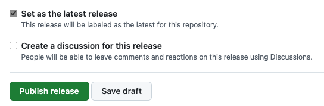
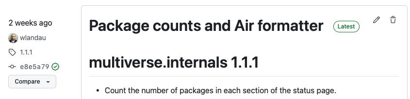

This page explains how to contribute packages to R-multiverse.

## Preparation

[R-multiverse policies](policies.md) govern all forms of participation in R-multiverse,
including package contributions.
Administrators, moderators, and contributors are all subject to the terms therein.
The [review policy](review.md) specifically governs package contribution and review.

In addition, R-multiverse pulls R packages directly from
[releases](https://docs.github.com/en/repositories/releasing-projects-on-github/about-releases) on GitHub and GitLab.
Before contributing a package to R-multiverse, please ensure it is available
in a public GitHub/GitLab source code repository with at least one
[release](https://docs.github.com/en/repositories/releasing-projects-on-github/about-releases) ([example](https://github.com/pola-rs/r-polars/releases/tag/v0.21.0)).

## Registration

To register a package with R-multiverse:

1. Navigate to <https://github.com/r-multiverse/contributions>.
1. Contribute a [package listing](https://github.com/r-multiverse/contributions/tree/main/packages) via
[GitHub pull request](https://docs.github.com/en/pull-requests/collaborating-with-pull-requests/proposing-changes-to-your-work-with-pull-requests/about-pull-requests).

Watch this 1-minute video to learn how:



### Package listings

A package listing is a text file in <https://github.com/r-multiverse/contributions/tree/main/packages>
which points to the home of the package on GitHub/GitLab.
The file name of each listing is the name of the package.
In most cases, the file itself contains the package URL on GitHub or GitLab ([example](https://github.com/r-multiverse/contributions/blob/main/packages/polars)).
But if the package is a subdirectory of the GitHub/GitLab repository,
you may instead write custom JSON list with fields `package`, `url`, `subdir`, and `branch: "*release"` ([example](https://github.com/r-multiverse/contributions/blob/main/packages/arrow)).

### Pull request review

A pull request in <https://github.com/r-multiverse/contributions/pulls> is reviewed by a bot and usually by a human [moderator](governance.md#moderator).
If the pull request author is a public member of [one of these GitHub organizations](https://github.com/r-multiverse/contributions/blob/main/organizations), then the bot may skip the human and accept the contribution automatically.
This is an extra level of trust we extend to accountable human members of communities that are well-established, trustworthy, and reputable.
You may propose a new organization via pull request, and the administrators will confidentially discuss the security implications before deciding whether to add it.

Some moderators only review packages specific to a subject matter area,
so please consider mentioning a [topic](https://r-multiverse.org/topics/index.html)
in the title of the pull request.

## Community

After registration, the latest GitHub/GitLab release of the package will
automatically appear in the [Community](community.md) repository, and you will see it in the dashboard at <https://community.r-multiverse.org>.
This process is facilitated by public [GitHub Actions](https://github.com/features/actions) workflows on both R-multiverse and R-universe^[Publishing a registered package requires 3 workflows in sequence: <https://github.com/r-multiverse/community/actions/workflows/review.yaml>, <https://github.com/r-multiverse/community/actions/workflows/packages.yaml>, and <https://github.com/r-universe/r-multiverse/actions/workflows/sync.yml>.], and it may take a few hours.

## Updating your package

To update your package to a new version on R-multiverse, simply create a new release on [GitHub](https://docs.github.com/en/repositories/releasing-projects-on-github/about-releases) or [GitLab](https://docs.gitlab.com/user/project/releases/).
[`usethis::use_github_release()`](https://usethis.r-lib.org/reference/use_github_release.html) makes this process easy for packages hosted on GitHub.^[See <https://juliasilge.com/blog/r-pkg-release/> for an example of a comprehensive package release workflow.]
If you instead create the release manually in the GitHub.com web interface, please be sure to set the new release as the latest release.
Sometimes the newest release does not automatically become "latest".
On GitHub, there is an important check box near the bottom of the web form:



After you create the release, you should see a "Latest" label on the right-hand side of the title.



If successful, the new version of your package should appear at <https://community.r-multiverse.org> after [the Community universe automatically refreshes](https://github.com/r-universe/r-multiverse/actions/workflows/sync.yml).

## Production

R-multiverse updates the [Production](production.qmd) repository in quarterly snapshots.
The [Production status page](https://r-multiverse.org/status/production.html) list the packages successfully staged for the next Production snapshot. 
Visit the [Production documentation](production.qmd) to learn how the process works.

## Status

It is good practice to check the health of your contributed package using [R-multiverse status system](https://r-multiverse.org/status/index.html).
You can read more about it [here in the Production page](production.qmd#status).

## Topics

R-multiverse has a [topics website](https://r-multiverse.org/topics/index.html) that organizes packages into subject matter areas.
Each topic has a page that lists the packages in its area ([example](https://r-multiverse.org/topics/bayesian.html)).
To contribute a package to a topic, simply list the topic URL in the `DESCRIPTION` file ([example](https://github.com/ropensci/stantargets/blob/db7d119ea0599eac3ce01a42bee27c9908754943/DESCRIPTION#L22)).
and then create a new GitHub/GitLab release.
To contribute a topic, submit a [pull request](https://github.com/r-multiverse/topics) to add a new [topic listing file](https://github.com/r-multiverse/topics/tree/main/topics) that describes the new topic.
A scheduled job periodically rebuilds the website from the [listings](https://github.com/r-multiverse/topics/tree/main/topics).

## Badges

[](https://community.r-multiverse.org/mirai)

To add a dynamic 'R-multiverse' badge for package readme files, like the one above, copy the following markdown snippet, replacing 'pkgNAME' with the actual package name in both places it appears:

```md
[](https://community.r-multiverse.org/pkgNAME)
```

## Deregistration

If it becomes necessary to deregister a package from R-multiverse, you may submit a
[pull request](https://docs.github.com/en/pull-requests/collaborating-with-pull-requests/proposing-changes-to-your-work-with-pull-requests/about-pull-requests)
to edit the [package listing](https://github.com/r-multiverse/contributions/tree/main/packages).
Please replace the URL/JSON contents with unstructured/free-form text to explain the reason for removing the package.
To prevent a package of the same name from registering in R-multiverse,
please do not delete the [package listing file](https://github.com/r-multiverse/contributions/tree/main/packages)
unless the package name itself violates R-multiverse [policies](policies.md).
Packages with missing or free-form listings are removed from [Community](community.md), and the subsequent [Production](production.qmd) snapshot will not include them. 

## Help

Please report bugs to <https://github.com/r-multiverse/help/issues> and send other feedback and questions to <https://github.com/r-multiverse/help/discussions>.
Please note that <https://github.com/r-multiverse/contributions> can only accept pull requests to add or modify package entries.
