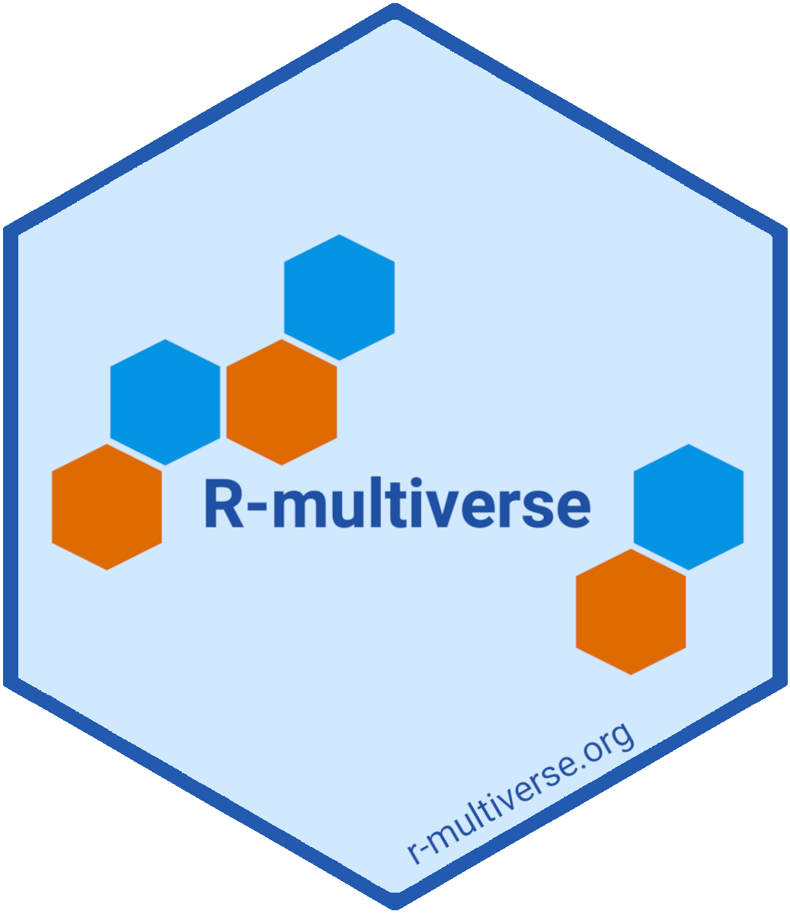

 
 

R-multiverse is a new initiative to establish a trustworthy, community-curated R package repository that runs on the open-source [r-universe](https://r-universe.dev) infrastructure.
We strive for [transparent governance](policies.md), high automation, and quarterly production releases. 
Visit the [overview page](overview.qmd) page to learn more.

